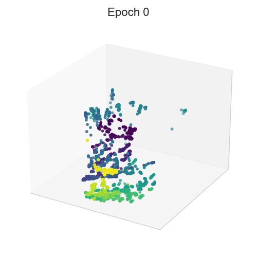

# MM-PHATE Reproducibility

This repository contains code to reproduce the **main figures** from the paper:

**Multiway Multislice PHATE: Visualizing Hidden Dynamics of RNNs through Training**

The code supports two reproducibility modes:

- **Cache mode (fast):** regenerate figures from cached artifacts (no training).
- **Full mode (slow):** train models + extract activations + run embeddings + generate figures from scratch.

---

## Method at a glance


MM-PHATE extends **M-PHATE** (Gigante et al., 2019) to handle the temporal nature of RNNs by constructing a **multiway multislice graph** across:

- **training epochs**
- **within-sequence time steps**
- **hidden units**

Key components include:

- Multiway multislice kernel construction across epochs, time steps, and units
- Structured affinities within and across time/epochs
- PHATE embedding for visualization
- Quantitative summaries (e.g., neighborhood preservation; entropy-based analyses in the paper)

---

## Repository layout (high level)

- `src/mmphate_repro/` : reusable library code (all logic lives here; avoid duplication)
- `configs/`           : manifests/configs mapping paper figures to pipelines
- `experiments/`       : thin entry scripts (optional; call into `src/`)
- `tests/`             : pytest tests (run via tox)
- `data/`              : datasets (not committed)
- `results_cache/`     : cached artifacts for fast reproduction (not committed unless small)
- `figures/`           : generated figures (not committed)

---

## Installation

### Windows (PowerShell)

Create a virtual environment:

```powershell
py -3.10 -m venv .venv
````

Activate the environment:

* PowerShell (may require adjusting execution policy):

```powershell
.\.venv\Scripts\Activate.ps1
```

* If PowerShell activation is blocked, use CMD instead:

```bat
.venv\Scripts\activate.bat
```

Install dependencies and the package:

For cache/figures:
```powershell
pip install -r requirements\base.txt
pip install -r requirements\dev.txt
pip install -e .
```

For full training:
```powershell
pip install -r requirements/full.txt
pip install -r requirements\dev.txt
pip install -e .
```

### macOS / Linux (bash)

For cache/figures:
```bash
python3.10 -m venv .venv
source .venv/bin/activate
pip install -r requirements/base.txt
pip install -r requirements/dev.txt
pip install -e .
```

For full training:
```bash
python3.10 -m venv .venv
source .venv/bin/activate
pip install -r requirements/full.txt
pip install -r requirements/dev.txt
pip install -e .
```

### Sanity check (all platforms)

```bash
python -c "import mmphate_repro; print(mmphate_repro.__version__)"
mmphate-repro -h
```

---

## Reproduce figures

### Cache mode (fast)

Cache mode regenerates the paper figures from precomputed embeddings/metrics stored under `results_cache/`.

```bash
mmphate-repro reproduce --mode cache
```

### Full recomputation (slow)

Full mode trains models and regenerates all embeddings and figures from scratch.

```bash
mmphate-repro reproduce --mode full
```

---

## Testing

Run tests in a clean environment using tox:

```bash
tox
```

---

## Determinism / reproducibility notes

We set random seeds in training and embedding scripts where possible. Some operations (especially GPU kernels and t-SNE) may remain nondeterministic across platforms or library versions. For the most faithful reproduction:

* use the pinned dependency versions listed in `requirements/`
* prefer running on the same OS/hardware when exact numerical equality is required
* expect small numerical differences across platforms to be possible

---

## Synthetic suite (main-text scenarios)

This repo includes a synthetic benchmark suite (Hopf/Pitchfork bifurcations and warp controls). A typical workflow is:

1. Run embeddings + neighborhood metrics for selected main-text scenarios (writes to `results_cache/synthetic/...`).
2. Generate the cached 2D grid figures (MM-PHATE vs PCA vs t-SNE, colored by epoch/timestep/unit/group).

(Exact commands depend on how you configured scenario names and filters in `mmphate-repro synthetic-suite` and `mmphate-repro synthetic-figures`.)

---

## Area2Bump dataset (data reference and citation)

For Area2Bump experiments, this repo expects **preprocessed** `.npy` files (not committed) under:

```
data/area2bump/
  trainX.npy
  trainy.npy
  testX.npy
  testy.npy
```

If you need to download and preprocess the original data, see the **DANDI Archive** entry for the dataset:

* Dandiset: `000127` (Area2_Bump)

If you use Area2_Bump in your research, please cite:

> Chowdhury, Raeed; Miller, Lee (2022) Area2_Bump: macaque somatosensory area 2 spiking activity during reaching with perturbations (Version 0.220113.0359) [Data set]. DANDI archive. [https://doi.org/10.48324/dandi.000127/0.220113.0359](https://doi.org/10.48324/dandi.000127/0.220113.0359)

---

## Acknowledgement

MM-PHATE builds upon the **M-PHATE** framework by Gigante et al. (2019), which pioneered multislice visualization of feedforward neural networks.

If you use M-PHATE in your research, please cite:

> S. Gigante, A. Charles, S. Krishnaswamy, G. Mishne. *Visualizing the PHATE of Neural Networks.* arXiv preprint arXiv:1908.02831, 2019. [https://arxiv.org/abs/1908.02831](https://arxiv.org/abs/1908.02831)

---

## Citation

If you use MM-PHATE in your research, please cite:

```bibtex
@misc{xie2024multiwaymultislicephatevisualizing,
      title={Multiway Multislice PHATE: Visualizing Hidden Dynamics of RNNs through Training},
      author={Jiancheng Xie and Lou C. Kohler Voinov and Noga Mudrik and Gal Mishne and Adam Charles},
      year={2024},
      eprint={2406.01969},
      archivePrefix={arXiv},
      primaryClass={cs.LG},
      url={https://arxiv.org/abs/2406.01969}
}
```
